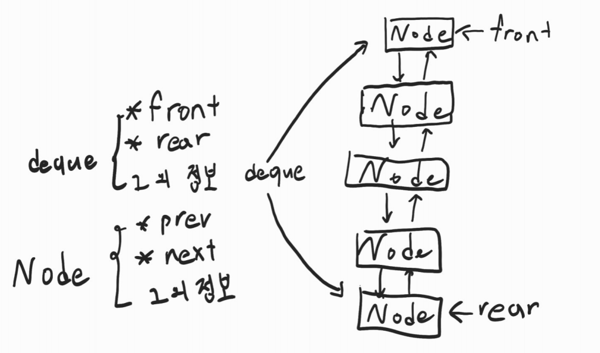

# DataStruct_HW1
## 문제

다음과 같은 조건의 은행이 있다.
1. 은행에 ATM기가 3개 있다. 사람이 들어가면 가장 줄이 짧은 ATM기에 줄을 선다. 동일한 길이의 줄이면 랜덤하게 결정한다. ATM기가 비어 있으면 기다리지 않고 바로 업무를 본다.
2. 9시 0분에 은행이 문을 열면 사람은 1분에 한 명씩 은행에 들어간다. 사람의 번호는 자신이 입장할 때의 분이다. 예를 들어 9시 47분에 들어간 사람은 47번이다. 9시 47분과 10시 47분에 들어간 사람의 번호는 동일하게 47번이다.
3. 은행에 들어간 사람의 일은 최소 2분에서 최대 10분이 소요되며, 이는 은행을 들어서며 랜덤하게 정해진다.
4. 시작 시간을 제외한 매 10분마다 (즉, 9시 10분, 9시 20분 등등), ATM기에 줄을 선 모든 사람들 중 번호가 소수인 사람은 줄을 이탈하여 은행을 나간다.
5. 은행에 들어오는 사람 중 10%는 VIP인데, 이들은 이들이 선택한 ATM기의 맨 처음에 줄을 선다. VIP또한 입장할 때 같은 원리로 번호를 받고, 일의 소요시간도 마찬가지이다.
</br>
</br>
은행에서 9시 0분부터 10시 59분까지 몇 번 고객이 몇 번 ATM기에서 서비스를 받는지를 출력하
라. 예를 들어,</br></br>
9시 0분 - 0번 고객(4분 소요)이 1번 ATM에서 서비스를 시작함</br>
9시 1분 - 1번 고객(5분 소요)이 3번 ATM에서 서비스를 시작함</br>
9시 2분 - 2번 고객(8분 소요)이 2번 ATM에서 서비스를 시작함</br>
9시 4분 - 3번 고객(6분 소요)이 1번 ATM에서 서비스를 시작함</br>
9시 6분 ? 5번 고객(3분 소요)이 3번 ATM에서 서비스를 시작함</br>
...

</br>
</br>
그리고 맨 마지막에는</br>
1) 총 몇 명의 고객이 업무를 보았는지</br>
2) 평균 몇 분 기다렸는지 (줄에 서있다가 나온 사람이 기다린 시간도 포함하여)</br>
3) 10시 59분 현재 몇 명이 기다리고 있는지를 출력
하라.

</br></br>
ATM기를 구현할 때, 리스트로 이루어진 큐를 사용하시오. 둘 중 하나만 사용하거나 사용하지 않
을 경우 감점임.

## 해설

### 어떤 자료구조를 사용해야 할까?

일단 아래에 조건에 따라 리스트로 된 큐를 구현해야 한다.
```
ATM기를 구현할 때, 리스트로 이루어진 큐를 사용하시오. 둘 중 하나만 사용하거나 사용하지 않을 경우 감점임.
```

그러나 큐는 FIFO(선입선출)로 이루어진 자료구조이다. 하지만 아래의 조건을 보면 양쪽에서 삽입을 해야 한다. 즉 양쪽에서 모두 삽입, 인출이 가능한 덱을 구현해야한다.
```
은행에 들어오는 사람 중 10%는 VIP인데, 이들은 이들이 선택한 ATM기의 맨 처음에 줄을 선다. VIP또한 입장할 때 같은 원리로 번호를 받고, 일의 소요시간도 마찬가지이다.
```

<details>
<summary>왜 덱을 사용할까?</summary>
<div markdown="1">
VIP가 아닌 일반 손님이 ATM기를 사용할려면 줄의 제일 끝에 서서 기다려야 한다. 즉 리스트의 마지막에 정보를 넣어야 한다. 그러나 VIP의 경우 ATM기의 대기열을 무시한 채 줄을 서므로 리스트의 앞에 정보를 넣어야 한다.
</div>
</details>

### 어떤 빙향으로 구현할까?

#### 생각해야할 조건
1. 연결리스트 덱 구현
2. 구조체 구현
3. 시간
4. 소요시간 및 줄을 서는 위치, VIP를 결정하는 방법
5. 번호가 소수인 사람들의 이탈
   
#### 1. 연결리스트 덱 구현
연결리스트의 장점은 제거하고 싶은 노드의 주소값만 알면 제거가 쉽고 추가할 때도 인접한 노드의 주소값만 알면 쉽게 추가 할 수 있다.</br>
연결리스트를 이용하여 덱을 구현할려면 연결리스트의 양끝의 주소값만 알면 삽입, 제거가 쉽다.
```c
// Deque
typedef struct Deque{
    Node *front;
    Node *rear;
    ...
}Deque;
```
```c
// Node
typedef struct Node{
    struct Node *prev;      // 이중 연결 리스트를 사용할 때
    struct Node *next;
    ...
}Node;
```

<details>
<summary>덱의 front와 rear가 하는 일은?</summary>
<div markdown="1">
연결리스트로 구현된 선형 자료에서 자료의 양 끝에 새로운 자료를 삽입 할려면 제일 앞 혹은 제일 뒤에 주소 값을 알고 있어야 한다. 즉 덱의 *front와 *rear에 각각 연결리스트의 제일 앞과 뒤의 주소값을 저장을 해 접근이 용이하도록 하였다.
</div>
</details>
</br>
</br>



</br>

#### 2. 구조체 구현
Node에 바로 정보를 넣어도 되지만 따로 구조체로 묶어서 표현하는 것이 코드 가독성에 좋다. 필자의 코드를 예시로 들면 유사도가 높아질 위험이 있기에 일부만 노출.

<details>
<summary>EX1</summary>
<div markdown="1">


Node에 바로 정보를 넣은 경우
```c
typedef struct Node{
    struct Node *prev;
    struct Node *next;
    int number;
    int vip;
    ...
}Node;
```
</br>
Customer이라는 구조체를 만들고 Node에 Customer이라는 구조체 넣기

```c
typedef struct Node{
    struct Node *prev;
    struct Node *next;
    Customer customer;
}Node;


typedef struct Customer{
    int number;
    int vip;
    ...
}Customer;
```

</div>
</details>

</br>

